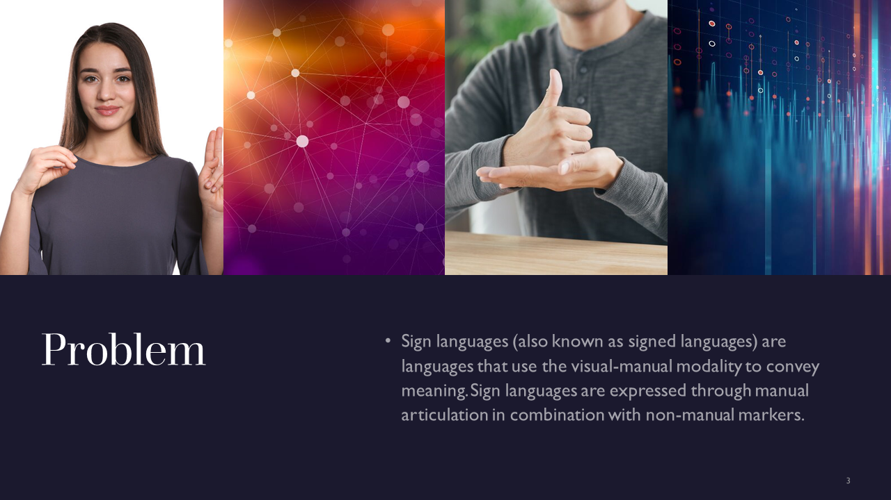

# ActionDetectionforSignLanguage

**Problem: Action Detection for Sign Language**

1. **Challenge**: Sign language action detection poses unique challenges due to the dynamic and expressive nature of sign language gestures, requiring accurate recognition and classification of hand movements, facial expressions, and body poses.

2. **Limited Datasets**: Availability of large-scale, annotated sign language action datasets is limited, making it difficult to train deep learning models effectively and generalize across different sign languages and variations.

3. **Complexity**: Sign language actions often involve intricate and subtle movements that can be challenging to capture accurately, requiring sophisticated algorithms and feature extraction techniques to capture the temporal and spatial dynamics of the gestures.

4. **Real-time Recognition**: Achieving real-time action detection for sign language is crucial to enable seamless communication between sign language users and non-signers, necessitating efficient and low-latency algorithms that can process video streams or live feeds in real-time.

5. **Interpretation Variability**: Variations in sign language interpretation across regions and individuals add another layer of complexity to the problem, demanding robust and adaptable models that can handle different sign language styles and idiosyncrasies.

    
    

## MediaPipe

MediaPipe is an open-source framework developed by Google that provides a customizable pipeline for building various types of real-time multimedia processing applications. It offers a wide range of pre-built components and models for tasks such as hand tracking, pose estimation, face detection, object tracking, and more.

### Key Features

- **Flexibility**: MediaPipe allows developers to construct complex multimedia pipelines using a modular approach, making it easy to customize and combine different components based on specific application requirements.

- **Cross-platform**: It supports multiple platforms, including desktop, mobile, and embedded devices, making it versatile and adaptable for various hardware configurations.

- **Real-time Processing**: MediaPipe is designed for real-time multimedia processing, enabling efficient and low-latency inference on live video streams or recorded content.

- **Efficient Acceleration**: The framework leverages hardware acceleration technologies, such as GPU and specialized neural network accelerators, to optimize performance and achieve fast execution speeds.

- **Machine Learning Support**: MediaPipe seamlessly integrates with popular machine learning frameworks like TensorFlow, allowing developers to incorporate deep learning models and perform inference on the captured media data.

### Use Cases

- **AR/VR Applications**: MediaPipe can be used to build augmented reality (AR) and virtual reality (VR) applications, enabling real-time tracking and interaction with the user's hands, face, and body.

- **Robotics**: It can be applied to robotics projects for tasks such as object detection and tracking, gesture recognition, and human-robot interaction.

- **Content Creation**: MediaPipe facilitates content creation workflows by providing tools for facial effects, gesture-based controls, and body tracking, enabling enhanced experiences in video production and gaming.

- **Surveillance and Security**: It can be utilized in surveillance systems for real-time video analysis, object detection, and tracking to enhance security and monitoring capabilities.

- **Healthcare**: MediaPipe's pose estimation and tracking capabilities can be utilized in healthcare applications for gait analysis, rehabilitation monitoring, and posture assessment.

For more detailed information, documentation, and examples, visit the official [MediaPipe GitHub repository](https://github.com/google/mediapipe).

